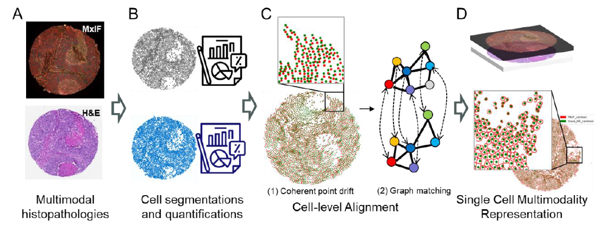
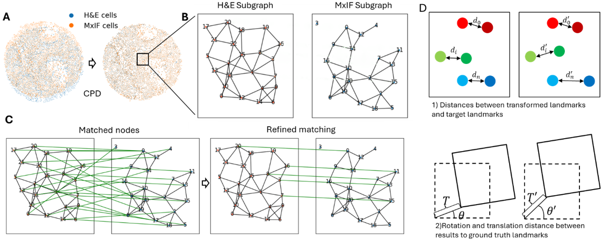
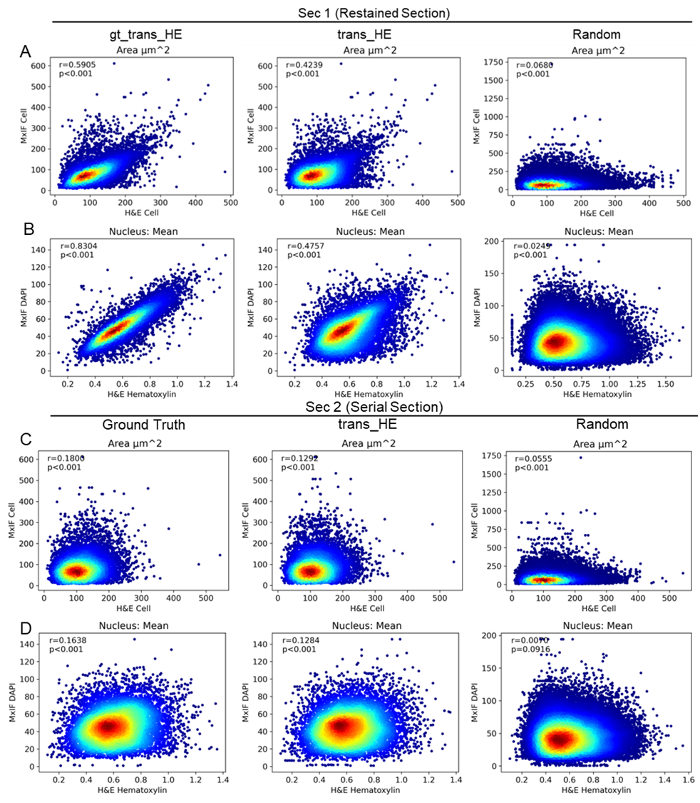
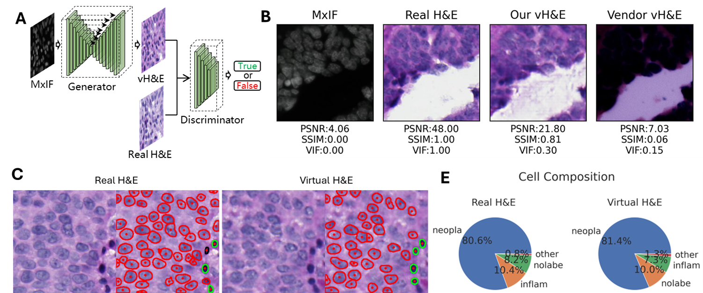

# Multimodality Histochemistry Combination
Multiplexed immunofluorescence (MxIF) signals are often compromised due to the complexities of cyclic staining protocols. We present a novel framework incorporating clinical-grade H&E staining as a reference to enhance the reliability and interpretability of MxIF analyses, focusing on cell spatial co-localization, cell feature validation, and virtual H&E generation.



Figure 1. Overview of our framework. A) MxIF and H&E images to be aligned; B) Cell segmentations and quantifications; C) Cell-level alignment. 1) coherent point drift. 2) graph matching; D) Aligned MxIF and H&E images with combined cell-level representations.

## Installation
```Shell
conda create --prefix /path_to_your_envs/alignment python=3.8.2
conda activate alignment
pip install scikit-learn
pip install probreg
pip install pygmtools
pip install cupy
```

## Modules
### Preprocessing
#### TMA de-array
De-array is a process that gets the tissue core out of the whole slide image, and then save the cores into FOV images.

> See [De-array](Dearray/Readme.md) for more detail

#### Cell segmentation
StarDist was used as our baseline for cell segmentation. However, our alignment framework is portable to different cell segmentation methods, as it only rely on detected cell centroids.

> See [Cell detection](CellDetection/Readme.md) for more detail

### Cell spatial co-localization 
The cell co-localization was formulated as a point set alignment problem. Using cell detection outputs from each modality as anchors, Coherent Point Drift (CPD) was employed for
initial alignment, followed by Graph Matching (GM) for refinement. The alignment accuracy was evaluated with 1) Distances between landmarks after transformation and target landmarks. 2) Rotation and translation differences between automatic method and manual annotation. 

> Check the client code [here](release/readme.md)

There are two options to run the client:
* [Start from cell segmentation results](/release#start-from-mxif-and-he-cell-segmentation-results);
* [Directly from the H&E and MxIF images](release#directly-start-from-mxif-and-he-image).


Figure 2. Illustration of alignment algorithms and alignment accuracy evaluation method. 

### Cell feature validation
H&E-stained images are commonly used to provide cell-level referencing when MxIF images are inspected. Ideally, the same tissue section used for MxIF should be restained with H&E after
the MxIF scanning to ensure identical referencing. However, the tissue may become damaged after multiple rounds of MxIF imaging, resulting in incomplete or compromised H&E staining. Many studies use the serial sections from the same tissue block for H&E staining. But the question is, how reliable are serial section H&E images as references for MxIF analysis when restained H&E is not available?

Our evaluations on staining and morphology feature for both re-stained and serial sections showed that restained section provide significantly higher concordance in cell features. 

To run similar feature validation, check the code [here](release/eval/cell_feature_eval.py). Please ensure the morphology and staining features are in the list.
> Define your [morphology features](https://github.com/dimi-lab/MultimodalityHistoComb/blob/71385b4f4945e3e31fd8c614af75e0ec8aa3049c/release/eval/cell_feature_eval.py#L22).

> Define your staining features for [H&E](https://github.com/dimi-lab/MultimodalityHistoComb/blob/71385b4f4945e3e31fd8c614af75e0ec8aa3049c/release/eval/cell_feature_eval.py#L27) and [MxIF](https://github.com/dimi-lab/MultimodalityHistoComb/blob/71385b4f4945e3e31fd8c614af75e0ec8aa3049c/release/eval/cell_feature_eval.py#L30).


Figure 3. Cell feature concordance under different conditions. 

### Virtual H&E generation
Many MxIF platforms offer virtual H&E images as the "re-stained H&E reference" for reliable MxIF interpretation. However, the quality of virtual H&E is often insufficient for clinical purposes.Can high-quality virtual H&E images be generated from MxIF data to serve as a reliable reference, similar to restained H&E?


Figure 4. Generate virtual H&E when re-stained H&E image is not available. Evaluation demonstrated that the generated virtual H&E and real H&E share similar cell population.

## References
Preprint: [Jiang, Jun, Raymond Moore, Brenna Novotny, Leo Liu, Zachary Fogarty, Ray Guo, Markovic Svetomir, and Chen Wang. "Multimodal Alignment of Histopathological Images Using Cell Segmentation and Point Set Matching for Integrative Cancer Analysis." arXiv preprint arXiv:2410.00152 (2024).](https://arxiv.org/abs/2410.00152)
