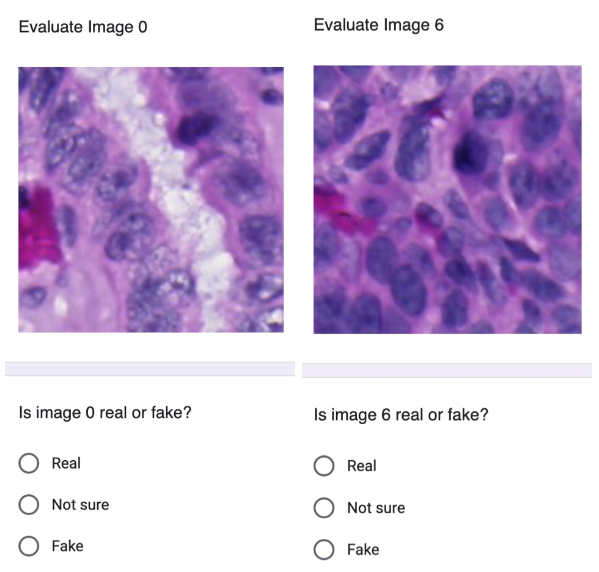

# Creating Virtual H&E from MxIF image channels

## Steps:

1. Align H&E and MxIF images, save H&E, get patch extraction locations.
2. Extract patches from both MxIF and H&E, save into image pairs [code](data_prepration/extract_HE_MxIF_pair.py)
3. Train the model [script](train_eval/training.sh)
4. Evaluate the model [script](train_eval/eval.sh)

### Blind test 
We also created a blind test on Google Forms.
The script can be found [here](downstream/TF_test/load_virtual_HE.gs)

